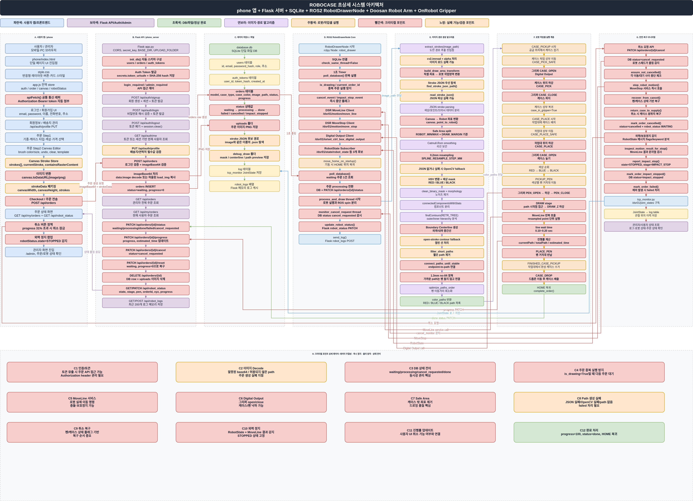
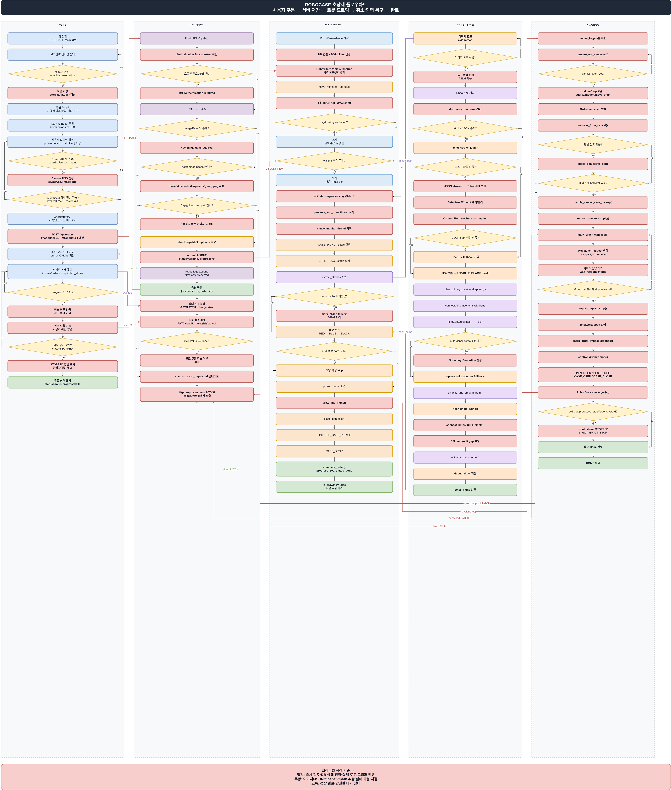

# [프로젝트 이름] 폰꾸꾸
> **조 이름:** [C-2 - ROKEY]
> **팀원:** [윤성웅_박지언_최민석_이원욱_황선우(중도포기)]

# ROBOCASE 폰케이스 그림 자동화 공정 (phone_ggu_ggu)

사용자가 웹 앱에서 직접 그린 도안 또는 업로드한 이미지를 서버에 주문으로 등록하고,  
**Doosan Robotics M0609 협동로봇**이 해당 도안을 실제 폰케이스 위에 자동으로 그려주는 프로젝트입니다.

앱(Phone) → 서버(Server) → 로봇(Robot) 구조로 구성되어 있으며,  
Canvas 드로잉 데이터, 이미지 파일, 주문 상태, 로봇 상태를 연동하여 하나의 커스텀 폰케이스 제작 공정을 구현했습니다.

---


## 시스템 설계 및 플로우 차트

프로젝트의 전체적인 구조와 소프트웨어 흐름도입니다.

### 시스템 아키텍처

<p align="center">
  
</p>

설명: Phone 앱, Flask 서버, SQLite DB, ROS2 RobotDrawerNode, Doosan M0609, OnRobot Gripper가 어떻게 연결되는지 나타낸 전체 시스템 아키텍처입니다.

---

### 플로우 차트

<p align="center">
  
</p>

설명: 사용자 주문 생성부터 서버 저장, 로봇 주문 감지, 경로 생성, 드로잉 수행, 취소 및 충격 정지 복구까지의 전체 실행 흐름을 나타낸 플로우 차트입니다.

### 전체 구성

- **Phone / Frontend**
  - HTML5 Canvas 기반 드로잉 UI
  - 기종 선택, 케이스 옵션 선택, 도안 생성, 주문 생성
  - Canvas 이미지와 `strokeData`를 서버로 전송
  - 주문 진행률, 취소 상태, 외부 충격 정지 상태 표시

- **Server / Backend**
  - Flask 기반 REST API 서버
  - SQLite DB를 이용한 주문, 사용자, 상태 관리
  - 업로드 이미지 저장
  - `strokeData` JSON 저장
  - 로봇 상태 및 로그 수신
  - 관리자 페이지 제공

- **Robot / Control**
  - ROS2 Humble + Python `rclpy`
  - Doosan M0609 협동로봇 제어
  - MoveLine 기반 드로잉 경로 추종
  - Digital I/O 기반 그리퍼 제어
  - 주문 취소, 외부 충격 정지, HOME 복귀 처리

---

### 전체 플로우

```text
사용자
  ↓
Phone UI
  - 기종/케이스 선택
  - Canvas 도안 생성
  - 이미지 또는 strokeData 생성
  ↓
Server
  - 주문 생성
  - 이미지 저장
  - strokeData JSON 저장
  - SQLite DB 상태 관리
  ↓
Robot
  - 주문 감지
  - 경로 생성
  - 케이스 픽업/세팅
  - 색상별 펜 픽업
  - MoveLine 드로잉
  - 펜 반납
  - 완성품 배출
  ↓
Server / Phone
  - 진행률 반영
  - 완료/취소/충격 정지 상태 표시
```

---

### 데이터 흐름

```text
Canvas Drawing UI
  ↓
Base64 이미지 + strokeData JSON
  ↓
POST /api/orders
  ↓
SQLite orders 테이블 저장
uploads/ 이미지 저장
uploads/ 동일 파일명 .json 저장
  ↓
RobotDrawerNode 주문 감지
  ↓
Stroke JSON 우선 사용
없으면 OpenCV 이미지 fallback
  ↓
Pixel 좌표 → Robot mm 좌표 변환
  ↓
MoveLine으로 실제 드로잉
```

---

### 주요 API

| Method | Endpoint | 설명 |
|---|---|---|
| POST | `/api/auth/signup` | 회원가입 |
| POST | `/api/auth/login` | 로그인 및 토큰 발급 |
| GET | `/api/auth/me` | 현재 로그인 사용자 확인 |
| POST | `/api/orders` | 신규 주문 생성 |
| GET | `/api/orders` | 전체 주문 목록 조회 |
| GET | `/api/my/orders` | 내 주문 목록 조회 |
| PATCH | `/api/orders/<id>/status` | 주문 상태 변경 |
| PATCH | `/api/orders/<id>/progress` | 주문 진행률 변경 |
| PATCH | `/api/orders/<id>/cancel` | 주문 취소 요청 |
| DELETE | `/api/orders/<id>` | 주문 삭제 |
| POST | `/api/robot_logs` | 로봇 로그 전송 |
| GET | `/api/robot_logs` | 로봇 로그 조회 |
| GET | `/api/robot_status` | 로봇 상태 조회 |
| PATCH | `/api/robot_status` | 로봇 상태 갱신 |

---

## 2) 운영체제 환경

권장/테스트 기준:

- **OS**: Ubuntu Linux
- **ROS 2**: Humble Hawksbill
- **Python**: 3.10.x
- **로봇**: Doosan Robotics M0609
- **로봇 네임스페이스**: `/dsr01`
- **서버 프레임워크**: Flask
- **DB**: SQLite
- **개발 도구**: VS Code
- **로봇 실행 워크스페이스**: `cobot_ws`

---

## 3) 사용한 장비 목록

- **협동로봇**
  - Doosan Robotics M0609

- **로봇 제어 PC**
  - Ubuntu Linux
  - ROS2 Humble
  - Doosan ROS2 패키지 및 `dsr_msgs2`

- **엔드이펙터**
  - Digital I/O 기반 그리퍼
  - 펜 픽업/반납
  - 케이스 픽업/배출

- **작업 대상**
  - iPhone 15 Plus 투명 폰케이스

- **작업 지그**
  - 빈 케이스 픽업 위치
  - 작업대 세팅 위치
  - 완성품 배출 위치
  - 펜 거치대

---

## 4) 의존성

Flask>=2.3.0
flask-cors>=4.0.0
opencv-python>=4.8.0
numpy>=1.24.0
requests>=2.31.0
Pillow>=10.0.0

# ROBOCASE dependency notes

## Python pip dependencies

Install with:

python3 -m pip install -r requirements.txt

## ROS2 / Robot dependencies

The following packages are NOT installed with pip.
They must already exist in the ROS2 Humble / Doosan Robotics workspace.

- rclpy
- std_msgs
- dsr_msgs2

Recommended environment:

source /opt/ros/humble/setup.bash
source ~/cobot_ws/install/setup.bash

## System / runtime

- Ubuntu Linux
- ROS2 Humble
- Python 3.10.x
- Doosan Robotics M0609 ROS2 package
- SQLite3

### Python 패키지

```txt
Flask
flask-cors
opencv-python
numpy
requests
```

### ROS2 / Robot 관련 패키지

```txt
rclpy
dsr_msgs2
std_msgs
```

### Frontend

```txt
HTML5
CSS3
Vanilla JavaScript
Feather Icons
```

---

## 5) 프로젝트 구조

```text
phone/
├── index.html
├── style.css
├── app.js
└── load_img/
    ├── ghost.png
    ├── puppy.png
    └── rabbit.png

phone_server/
├── app.py
├── robot_drawer.py
├── tcp_monitor.py
├── app.js
├── database.db
├── uploads/
└── templates/
    ├── index.html
    └── admin.html
```

---

## 6) 간단 사용 설명

### (A) 서버 실행

```bash
cd phone_server

python3 app.py
```

서버는 기본적으로 다음 주소에서 실행합니다.

```text
http://0.0.0.0:5000
```

같은 네트워크의 다른 기기에서는 서버 PC의 실제 IP로 접속합니다.

```text
http://<서버PC_IP>:5000
```

---

### (B) 웹 앱 실행

간단 테스트는 `phone/index.html`을 브라우저에서 열어 진행할 수 있습니다.

```bash
cd phone
python3 -m http.server 8080
```

브라우저에서 접속합니다.

```text
http://localhost:8080
```

또는 같은 네트워크의 모바일/다른 PC에서 다음처럼 접속합니다.

```text
http://<프론트PC_IP>:8080
```

---

### (C) 로봇 제어 노드 실행

ROS2 환경을 먼저 source 합니다.

```bash
source /opt/ros/humble/setup.bash
source ~/cobot_ws/install/setup.bash
```

서버가 실행된 상태에서 로봇 제어 코드를 실행합니다.

```bash
cd phone_server
python3 robot_drawer.py
```

로봇 노드는 주문을 감지한 뒤 다음 흐름을 수행합니다.

```text
주문 감지
↓
Stroke JSON 또는 이미지에서 path 생성
↓
케이스 픽업
↓
케이스 작업대 세팅
↓
색상별 펜 픽업
↓
MoveLine 드로잉
↓
펜 반납
↓
완성품 배출
↓
HOME 복귀
```

---

## 7) 로봇 제어 구조

### 사용 서비스

| 서비스 | 역할 |
|---|---|
| `/dsr01/motion/move_line` | 로봇 TCP를 지정 좌표로 직선 이동 |
| `/dsr01/motion/move_stop` | 주문 취소 또는 비정상 상황 시 로봇 정지 |
| `/dsr01/io/set_ctrl_box_digital_output` | 그리퍼 Digital I/O 제어 |

---

### 로봇 동작 단계

```text
1. HOME 복귀
2. 주문 대기
3. 대기 주문 감지
4. 이미지 / stroke JSON 경로 확인
5. 드로잉 path 생성
6. 빈 케이스 픽업
7. 케이스 작업대 세팅
8. 색상별 펜 픽업
9. MoveLine으로 path 추종
10. 펜 반납
11. 완성 케이스 배출
12. HOME 복귀
13. 주문 완료 처리
```

---

## 8) 드로잉 경로 생성 알고리즘

### 1순위: Stroke JSON 기반 경로 생성

사용자가 직접 그린 경우 앱에서 `strokeData`를 생성합니다.

```json
{
  "canvasWidth": 800,
  "canvasHeight": 1600,
  "strokes": [
    {
      "color": "#111111",
      "size": 5,
      "points": [
        { "x": 120.5, "y": 300.2 },
        { "x": 122.0, "y": 301.8 }
      ]
    }
  ]
}
```

서버는 이미지를 저장할 때 같은 이름의 JSON 파일을 함께 저장합니다.

```text
uploads/abc123.png
uploads/abc123.json
```

로봇은 이미지 파일명 기준으로 JSON을 탐색하고, 존재하면 이를 우선 사용합니다.

---

### 2순위: OpenCV 이미지 기반 fallback

Stroke JSON이 없는 경우에는 이미지 자체에서 선을 추출합니다.

```text
이미지 입력
↓
HSV 색상 분리
↓
RED / BLUE / BLACK mask 생성
↓
Morphology Closing
↓
Connected Component
↓
Contour 추출
↓
Boundary Centerline 계산
↓
Pixel path 생성
↓
Robot mm 좌표 변환
```

---

### OpenCV 처리 방식

| 단계 | 사용 기술 | 역할 |
|---|---|---|
| 색상 분리 | HSV Color Mask | RED / BLUE / BLACK 선 분리 |
| 끊김 보정 | Morphology Closing | 작은 픽셀 단위 끊김 보정 |
| 선 영역 분리 | Connected Component | 연결된 선 덩어리 분리 |
| 경계 추출 | Contour Extraction | 선 영역의 외부/내부 boundary 추출 |
| 중심선 계산 | Boundary Centerline | 외곽선이 아닌 중심 path 계산 |
| 좌표 변환 | Pixel → Robot mm | 이미지 좌표를 실제 로봇 좌표로 변환 |

---

### 최종 path 후처리

```text
Safe Area Filtering
↓
Catmull-Rom Spline
↓
0.2mm Resampling
↓
1.3mm Path Connect
↓
No-Lift Drawing
↓
Nearest Order
↓
MoveLine 실행
```

| 알고리즘 | 목적 |
|---|---|
| Safe Area Filtering | 케이스 밖 좌표 제거 |
| Catmull-Rom Spline | 곡선 path를 부드럽게 보간 |
| 0.2mm Resampling | 점 간격을 일정하게 재배치 |
| 1.3mm Path Connect | 가까운 path 연결 |
| No-Lift Drawing | 가까운 path는 펜을 들지 않고 연결 |
| Nearest Order | 가까운 path부터 그려 이동 거리 감소 |

---

## 9) 좌표 변환

앱 또는 이미지 좌표는 픽셀 단위입니다.  
로봇은 실제 공간에서 mm 단위 좌표로 움직이기 때문에 좌표 변환이 필요합니다.

```text
Canvas px, py
↓
scale 계산
↓
x_offset / y_offset 적용
↓
Y축 반전
↓
Robot X, Y mm
```

개념 공식:

```text
rx = draw_min_x + x_offset + px × scale
ry = draw_max_y - y_offset - py × scale
```

Y축 반전이 필요한 이유는 이미지 좌표계와 로봇 좌표계의 방향이 다르기 때문입니다.

---

## 10) 안전 및 예외처리

### 주문 취소

주문 취소가 들어오면 단순히 코드 flag만 바꾸지 않고, 로봇 정지 서비스를 호출합니다.

```text
cancel_requested 감지
↓
/dsr01/motion/move_stop 호출
↓
현재 MoveLine 중단
↓
펜 상승
↓
펜 반납
↓
케이스 원위치 복구
↓
HOME 복귀
↓
cancelled 처리
```

---

### 외부 충격 정지

외력 또는 충돌 상황은 로봇 컨트롤러의 안전 정지가 우선입니다.

```text
외력 발생
↓
Doosan Controller Protective Stop / Safety Stop
↓
ROS2 RobotState 감지
↓
서버 로그 전송
↓
robot_status = IMPACT_STOP
↓
관리자 확인
```

충격 정지는 자동 복구보다 관리자 확인을 우선하도록 설계했습니다.

---

### 상태값

| 상태 | 의미 |
|---|---|
| `waiting` / `pending` | 주문 대기 |
| `processing` | 작업 중 |
| `done` / `completed` | 작업 완료 |
| `cancel_requested` | 취소 요청 접수 |
| `cancelled` | 취소 복구 완료 |
| `impact_stopped` | 외부 충격 정지 |

---

## 11) 개발 중 주요 디버깅 과정 및 알고리즘 개선 기록

이 프로젝트에서는 단순히 하나의 알고리즘만 사용한 것이 아니라,  
이미지 기반 경로 추출부터 실제 로봇 드로잉 안정화까지 여러 알고리즘과 파라미터를 반복적으로 테스트했습니다.

최종 방향은 다음과 같습니다.

```text
초기: 이미지 기반 Canny / Contour 추출
↓
문제 발견: 외곽선 중복, 선 끊김, path 분리, 곡선 누락
↓
중간 개선: HSV Mask, Morphology, Component Filtering, Skeleton, Boundary Centerline
↓
직선/곡선 판별 시도: path 직선성 계산, 곡률 기반 분기, 보간 강도 조정
↓
로봇 경로 안정화: Smoothing, Resampling, Path Connect, No-Lift Drawing
↓
최종 구조: Stroke JSON 우선 + OpenCV 이미지 fallback + MoveLine 제어
```

---

### 11-1. Canny Edge

- 목적: 이미지에서 선의 경계를 빠르게 검출하기 위해 테스트
- 사용 위치: 초기 이미지 기반 경로 추출 단계
- 처리 방식:
  - 이미지를 흑백 또는 색상 마스크로 변환
  - 밝기 변화가 큰 부분을 edge로 검출
  - 검출된 edge를 contour/path 후보로 사용
- 장점:
  - 구현이 빠름
  - 선 경계 검출이 잘 됨
  - 단순한 도형에서는 빠르게 결과 확인 가능
- 문제:
  - 중심선이 아니라 선의 외곽 경계를 검출함
  - 두꺼운 선의 양쪽 edge가 모두 검출됨
  - 결과적으로 로봇이 한 선을 두 번 그리는 문제가 발생
  - 선 내부/외부 edge가 섞여 path 정리가 어려움
- 결과:
  - 최종 알고리즘에서는 메인 방식으로 사용하지 않음
  - 이미지 기반 디버깅 초기 단계에서만 사용
- 정리:
  - Canny는 “선이 어디 있는지” 찾는 데는 좋지만, “로봇이 따라갈 중심 path”를 만들기에는 부적합했습니다.

---

### 11-2. Contour Direct Path

- 목적: 색상 mask에서 바로 외곽선을 추출해 로봇 path로 변환하기 위해 사용
- 사용 기술:
  - `cv2.findContours()`
  - contour 좌표를 pixel path로 변환
- 처리 방식:
  - 색상별 mask 생성
  - mask에서 contour 추출
  - contour 좌표를 로봇 좌표로 변환
  - MoveLine으로 contour를 따라감
- 장점:
  - 색상 mask에서 바로 path 생성 가능
  - 구현이 단순함
  - 닫힌 도형이나 외곽 형태를 찾기 쉬움
- 문제:
  - contour는 중심선이 아니라 외곽선임
  - 굵은 선은 테두리를 따라가게 됨
  - 한 선을 한 번만 그리는 것이 아니라 외곽선을 따라 중복 드로잉하는 문제가 생김
  - 내부 contour와 외부 contour가 섞이면 경로가 꼬일 수 있음
- 결과:
  - 단독 사용은 제외
  - 이후 Boundary Centerline 방식의 기반 정보로만 활용
- 정리:
  - Contour는 “선 영역의 테두리”를 찾는 데는 유용하지만, 그대로 로봇 path로 쓰면 중복 드로잉 문제가 발생했습니다.

---

### 11-3. HSV Color Mask

- 목적: 이미지에서 RED / BLUE / BLACK 선을 색상별로 분리하기 위해 사용
- 사용 위치:
  - Stroke JSON이 없을 때 이미지 fallback 경로 생성
- 처리 방식:
  - OpenCV로 이미지 로드
  - BGR 이미지를 HSV 색공간으로 변환
  - 색상별 HSV 범위 지정
  - `cv2.inRange()`로 색상별 mask 생성
- 장점:
  - RGB보다 색상 분리에 유리함
  - 펜 색상별 path 분리가 가능함
  - RED / BLUE / BLACK을 따로 처리할 수 있음
- 문제:
  - 조명, 이미지 압축, anti-aliasing의 영향을 받음
  - 검정색은 밝기 조건에 따라 배경과 섞일 수 있음
  - 색이 흐리면 mask에서 일부 픽셀이 빠질 수 있음
- 결과:
  - 이미지 fallback의 기본 전처리 방식으로 유지
- 정리:
  - 색상별 펜을 사용해야 했기 때문에 HSV mask는 필수 전처리 단계였습니다.

---

### 11-4. Morphology Closing

- 목적: 색상 mask에서 픽셀 단위로 끊긴 선을 보정하기 위해 사용
- 사용 기술:
  - `cv2.morphologyEx(mask, cv2.MORPH_CLOSE, kernel)`
- 처리 방식:
  - Dilation으로 흰색 영역을 살짝 확장
  - Erosion으로 다시 줄임
  - 작은 구멍과 끊김을 메움
- 장점:
  - 끊긴 픽셀 연결에 도움
  - path가 너무 잘게 분리되는 문제 완화
  - 작은 빈틈 제거 가능
- 문제:
  - 너무 강하게 적용하면 떨어져 있어야 할 선들이 붙음
  - 붙은 선은 하나의 component로 인식되어 path 분리가 어려워짐
- 결과:
  - 이미지 fallback에서 유지
  - 강도는 과하지 않게 적용하는 방향으로 조정
- 정리:
  - 선 끊김을 줄이는 데 효과가 있었지만, 과하면 오히려 선들이 합쳐지는 문제가 있어 균형이 중요했습니다.

---

### 11-5. Connected Component Filtering

- 목적: 색상 mask에서 연결된 선 덩어리를 component 단위로 분리하고 작은 노이즈를 제거하기 위해 사용
- 사용 기술:
  - `cv2.connectedComponentsWithStats()`
- 주요 파라미터:
  - `MIN_MASK_COMPONENT_AREA = 5`
- 처리 방식:
  - binary mask에서 연결된 픽셀 덩어리를 찾음
  - 각 component의 면적 계산
  - 너무 작은 component는 노이즈로 판단해 제거
- 장점:
  - 작은 노이즈 제거 가능
  - 선 덩어리별로 path를 따로 생성할 수 있음
- 문제:
  - 기준이 너무 크면 실제 짧은 stroke도 제거됨
  - 기준이 너무 작으면 노이즈가 많이 남음
  - 서로 붙은 선은 하나의 component로 합쳐짐
- 결과:
  - `MIN_MASK_COMPONENT_AREA = 5` 수준으로 작은 stroke를 최대한 살리는 방향으로 조정
- 정리:
  - 노이즈 제거와 세부 stroke 보존 사이의 균형을 맞추는 것이 핵심이었습니다.

---

### 11-6. Skeletonization

- 목적: 두꺼운 선을 1픽셀 중심선으로 줄여 로봇이 한 번만 따라가게 하기 위해 테스트
- 주요 파라미터:
  - `SKELETON_MIN_PIXELS = 3`
- 장점:
  - 이론적으로는 중심선 추출 목적에 가장 가까움
  - 외곽선 중복 드로잉 문제를 줄일 수 있어 보였음
- 문제:
  - 실제 결과가 점묘화처럼 끊김
  - 곡선에서 선이 분리됨
  - Y자, 교차점, 복잡한 캐릭터 선에서 분기 발생
  - 노이즈에 민감함
  - 로봇 path로 사용하기에는 안정성이 낮음
- 결과:
  - 최종 알고리즘에서 제외
- 정리:
  - Skeleton은 중심선을 만들 수는 있었지만, 실제 드로잉 결과가 불안정해 최종 방식에서는 사용하지 않았습니다.

---

### 11-7. Boundary Centerline

- 목적: contour가 외곽선을 따라가며 한 선을 두 번 그리는 문제를 줄이기 위해 적용
- 처리 방식:
  - component에서 contour 추출
  - 외부 boundary와 내부 boundary 또는 양쪽 boundary rail을 분석
  - 가까운 boundary 점 쌍을 찾음
  - 두 점의 중간 좌표를 계산
  - 중심 path 생성
- 장점:
  - 외곽선이 아니라 선의 중앙을 따라갈 수 있음
  - 중복 드로잉 감소
  - contour direct 방식보다 실제 로봇 드로잉에 적합
- 문제:
  - 선이 너무 얇으면 외부/내부 boundary 구분이 약함
  - 선이 붙어 하나의 component가 되면 매칭이 꼬일 수 있음
  - Y자, 교차점, 복잡한 캐릭터 선에서는 중심선 계산이 어려움
  - 가장 가까운 boundary 점이 실제 반대쪽 선이 아닐 수 있음
- 결과:
  - 이미지 fallback에서 중심 path 생성 방식으로 사용
- 정리:
  - 이미지 기반 방식 중에서는 contour 중복 문제를 줄이는 데 가장 현실적인 개선 방식이었습니다.

---

### 11-8. Path Boundary Nearest Midline

- 목적: 같은 path 내부에서 외부선과 내부선을 찾아 가장 가까운 점들의 중간 좌표를 따라가게 하기 위해 테스트
- 처리 방식:
  - 같은 component 내부의 boundary 점들을 추출
  - 외부 boundary 점마다 가장 가까운 내부 boundary 점을 탐색
  - 두 점의 중간 좌표를 계산
  - 중간점들을 이어 중심 path 생성
- 장점:
  - 외곽선을 그대로 따라가는 문제를 줄일 수 있음
  - 선 중앙을 한 번만 따라가는 결과를 기대할 수 있음
- 문제:
  - 가장 가까운 점이 실제 반대쪽 boundary가 아닐 수 있음
  - 복잡한 선이나 교차선에서 잘못된 중간점 발생
  - 닫힌선과 열린선이 섞이면 판단이 어려움
- 결과:
  - 단순한 선에서는 효과가 있었지만, 복잡한 도안에서는 오히려 이상한 path가 생길 수 있음을 확인
- 정리:
  - “가장 가까운 점의 중간”이라는 규칙만으로는 모든 선 구조를 안정적으로 처리하기 어렵다는 점을 확인했습니다.

---

### 11-9. 열린선 / 닫힌선 분류

- 목적: 열린선과 닫힌선은 boundary 구조가 다르기 때문에 서로 다른 방식으로 중심 path를 계산하기 위해 검토
- 열린선:
  - 시작점과 끝점이 있음
  - 일반 선, 곡선, 글씨 일부
  - 양쪽 boundary rail을 나누어 중심 path 계산
- 닫힌선:
  - 시작점과 끝점이 이어진 구조
  - 원, 고리, 닫힌 캐릭터 외곽
  - outer contour와 inner contour를 이용해 중심 path 계산
- 장점:
  - 선 구조에 맞는 처리 가능
  - 닫힌 도형에서 외곽선/내곽선 중심 계산 가능
- 문제:
  - 실제 이미지에서는 닫힌선 여부를 안정적으로 판단하기 어려움
  - 선이 조금만 끊겨도 닫힌선이 열린선처럼 인식될 수 있음
  - 열린선인데 두꺼운 선 때문에 닫힌 contour처럼 보일 수 있음
- 결과:
  - 이미지 fallback의 판단 로직 중 하나로 검토
- 정리:
  - 열린선과 닫힌선을 나누는 접근은 필요했지만, 이미지 기반 판단만으로는 완전하지 않았습니다.

---

### 11-10. Stroke JSON

- 목적: 이미지 추정 대신 사용자가 직접 그린 좌표 정보를 사용하기 위해 적용
- 저장 정보:
  - `canvasWidth`
  - `canvasHeight`
  - `strokes`
  - `color`
  - `size`
  - `points`
  - `points[].x`
  - `points[].y`
- 장점:
  - 각 stroke 내부의 점 순서가 보존됨
  - 색상 정보가 직접 저장됨
  - 이미지 추정보다 path 생성이 안정적임
  - Canny / Contour / Skeleton보다 원본 입력에 가까움
- 초기 문제:
  - 프론트에서는 `strokeData`를 서버로 보내고 있었음
  - 하지만 서버가 이를 `.json` 파일로 저장하지 않아 로봇이 실제로 사용하지 못함
- 수정 내용:
  - 서버 `app.py`에서 `strokeData = data.get("strokeData")` 처리 추가
  - 이미지와 같은 이름의 `.json` 파일로 저장하도록 수정
  - 예시:
    ```text
    uploads/abc123.png
    uploads/abc123.json
    ```
- 주의:
  - 전체 로봇 실행 순서가 사용자의 원본 그리기 순서와 100% 같지는 않을 수 있음
  - 색상별 펜 교체와 path 최적화 과정에서 실행 순서는 재정렬될 수 있음
- 결과:
  - 최종 구조에서 Stroke JSON을 1순위 입력으로 설정
- 정리:
  - Stroke JSON은 이미지 기반 추정보다 안정적인 경로 생성을 가능하게 했고, 서버 저장 로직을 추가하면서 실제 로봇이 사용할 수 있는 구조로 개선했습니다.

---

### 11-11. OpenCV 이미지 Fallback

- 목적: Stroke JSON이 없거나 이미지 업로드/템플릿 도안만 있는 경우에도 로봇 경로를 생성하기 위해 사용
- 처리 흐름:
  ```text
  이미지 입력
  ↓
  HSV 색상 분리
  ↓
  RED / BLUE / BLACK mask 생성
  ↓
  Morphology Closing
  ↓
  Connected Component
  ↓
  Contour 추출
  ↓
  Boundary Centerline
  ↓
  Pixel path 생성
  ↓
  Robot mm 좌표 변환
  ```
- 장점:
  - JSON 없이도 이미지에서 path 생성 가능
  - 업로드 이미지나 템플릿 도안 처리 가능
  - 색상별 펜 분리 가능
- 문제:
  - 원본 stroke 순서를 알 수 없음
  - 붙은 선, 교차선, Y자 구조에 취약
  - 이미지 품질과 색상 조건에 영향을 받음
- 결과:
  - 최종 구조에서 2순위 fallback으로 유지
- 정리:
  - OpenCV 방식은 보조 수단으로 유용하지만, 안정성은 Stroke JSON보다 낮기 때문에 fallback으로 사용하는 것이 적절했습니다.

---

### 11-12. Pixel 좌표 → Robot mm 좌표 변환

- 목적: Canvas 또는 이미지 픽셀 좌표를 실제 로봇 TCP가 움직일 수 있는 mm 좌표로 변환
- 처리 방식:
  - 이미지 크기와 로봇 드로잉 영역 크기 비교
  - scale 계산
  - x_offset, y_offset으로 중앙 정렬
  - Y축 반전
  - robot X/Y 좌표 생성
- 개념 공식:
  ```text
  rx = draw_min_x + x_offset + px × scale
  ry = draw_max_y - y_offset - py × scale
  ```
- 관련 파라미터:
  - `ROBOT_MIN_X`
  - `ROBOT_MAX_X`
  - `ROBOT_MIN_Y`
  - `ROBOT_MAX_Y`
  - `DRAW_MARGIN = 2.0`
- 장점:
  - 앱/이미지 좌표를 실제 로봇 좌표로 변환 가능
  - 이미지 비율을 유지하면서 중앙 정렬 가능
- 문제:
  - 로봇 X/Y 영역 비율이 실제 케이스와 맞지 않으면 그림이 좌우로 압축됨
  - margin이 너무 크면 실제 드로잉 영역이 줄어듦
- 결과:
  - 좌표 변환 및 캘리브레이션 단계에서 반복 조정
- 정리:
  - 로봇 드로잉 품질은 알고리즘뿐 아니라 X/Y 작업 영역 캘리브레이션에도 크게 영향을 받았습니다.

---

### 11-13. Safe Area Filtering

- 목적: 폰케이스 밖이나 위험 영역으로 로봇이 그리지 않도록 제한
- 처리 방식:
  - 변환된 robot 좌표가 드로잉 가능 영역 안에 있는지 확인
  - 영역 밖 좌표는 제거하거나 path를 분리
- 관련 파라미터:
  - `DRAW_MARGIN = 2.0`
  - `ROBOT_MIN_X / MAX_X`
  - `ROBOT_MIN_Y / MAX_Y`
- 장점:
  - 케이스 밖으로 나가는 문제 방지
  - 작업 안전성 향상
- 문제:
  - safe area가 너무 좁으면 실제 필요한 선이 잘릴 수 있음
  - 일부 영역이 “아예 안 그려지는 문제”로 보일 수 있음
- 결과:
  - 최종 경로 생성 후 필터링 단계로 유지
- 정리:
  - UI에서는 자유롭게 그릴 수 있게 하고, 로봇 단계에서 최종 안전 영역을 보장하는 방식으로 설계했습니다.

---

### 11-14. Catmull-Rom Spline 보간

- 목적: 점과 점 사이를 부드럽게 이어 곡선 품질을 높이기 위해 사용
- 처리 방식:
  - 주변 점들을 이용해 중간 좌표 생성
  - 각진 path를 부드러운 곡선으로 보정
- 장점:
  - 곡선이 자연스러워짐
  - 로봇 이동이 부드러워짐
  - 드로잉 품질 개선
- 문제:
  - 너무 과하게 보간하면 원본보다 path가 변형될 수 있음
  - 이후 resampling과 함께 적용해야 점 간격이 안정됨
- 결과:
  - 최종 path 후처리 단계에 유지
- 정리:
  - 곡선 품질 개선에는 효과적이었고, resampling과 함께 사용해야 안정적인 결과가 나왔습니다.

---

### 11-15. 직선 / 곡선 판별 시도

- 목적: 추출된 path가 직선에 가까운지, 곡선에 가까운지 판단해서 서로 다른 방식으로 보정하기 위해 시도
- 시도 배경:
  - 모든 path에 같은 보간을 적용하면 직선이 미세하게 흔들려 보일 수 있음
  - 반대로 보간을 약하게 하면 곡선이 각져 보이거나 끊겨 보일 수 있음
  - 따라서 직선은 최대한 원본 좌표를 유지하고, 곡선은 보간과 resampling을 더 적극적으로 적용하는 방식을 검토
- 판별 아이디어:
  - path의 시작점과 끝점을 하나의 기준 직선으로 설정
  - path 내부 점들이 기준 직선에서 얼마나 벗어나는지 계산
  - 점들의 방향 변화량 또는 누적 각도 변화량을 확인
  - 시작점과 끝점 사이 거리 대비 실제 path 길이가 얼마나 더 긴지 비교
- 판단 기준 개념:
  ```text
  기준 직선에서 벗어난 거리 작음
  + 전체 방향 변화량 작음
  + 실제 path 길이와 시작-끝 직선 거리 차이 작음
  → 직선으로 판단

  기준 직선에서 벗어난 거리 큼
  또는 방향 변화량 큼
  또는 실제 path 길이가 시작-끝 거리보다 많이 김
  → 곡선으로 판단
  ```
- 직선으로 판단했을 때 처리:
  - 과한 spline 보간을 줄임
  - 시작점과 끝점 방향을 최대한 유지
  - 불필요한 중간 흔들림을 줄여 직선이 휘어지는 현상 완화
- 곡선으로 판단했을 때 처리:
  - Catmull-Rom 보간 적용
  - 0.2mm resampling으로 점 간격 균일화
  - 곡선부가 각져 보이지 않도록 path를 부드럽게 보정
- 장점:
  - 직선과 곡선을 같은 방식으로 처리했을 때 생기는 품질 차이를 줄일 수 있음
  - 직선은 직선답게 유지하고, 곡선은 부드럽게 만드는 방향으로 개선 가능
  - path별 특성에 따라 보정 강도를 다르게 줄 수 있음
- 문제:
  - 짧은 path는 직선/곡선 판단 근거가 부족함
  - 이미지 추출 과정에서 생긴 노이즈 때문에 실제 직선도 곡선처럼 판단될 수 있음
  - 하나의 path 안에 직선 구간과 곡선 구간이 섞이면 path 단위 판단만으로는 한계가 있음
  - 기준값이 너무 엄격하면 대부분 곡선으로 분류되고, 너무 느슨하면 실제 곡선도 직선으로 분류됨
  - 중심선 추출 결과가 흔들리면 직선/곡선 판별도 함께 불안정해짐
- 결과:
  - 직선/곡선 분리 처리는 디버깅 과정에서 검토했지만, 최종적으로는 전체 path에 대해 Catmull-Rom 보간, 0.2mm resampling, 1.3mm Path Connect를 적용하는 방식이 더 안정적이라고 판단
  - 직선/곡선 판별은 향후 품질 개선 방향으로 남김
- 정리:
  - 직선/곡선 판별은 그림 품질을 더 높이기 위한 시도였지만, 이미지 기반 path 자체가 흔들리는 상황에서는 분류 정확도보다 전체 path 안정화가 우선이라고 판단했습니다.

---

### 11-16. 직선 / 곡선별 보간 분기 시도

- 목적: 직선으로 판단된 path와 곡선으로 판단된 path에 서로 다른 후처리를 적용하기 위해 검토
- 처리 방식:
  ```text
  path 입력
  ↓
  직선성 계산
  ↓
  직선 path
    → 보간 최소화
    → 점 간격만 정리
    → MoveLine으로 직선성 유지

  곡선 path
    → Catmull-Rom 보간
    → 0.2mm resampling
    → 부드러운 곡선 path 생성
  ```
- 장점:
  - 직선 path가 spline으로 인해 살짝 휘어지는 문제를 줄일 수 있음
  - 곡선 path는 부드럽게 보정할 수 있음
  - path 특성에 따라 후처리 강도를 다르게 줄 수 있음
- 문제:
  - 직선과 곡선이 섞인 복합 path는 하나의 class로만 판단하기 어려움
  - path를 더 작은 segment로 나누면 정확도는 올라가지만 path 개수가 늘어남
  - path 개수가 늘어나면 펜 Up/Down, MoveLine 명령 수, 작업 시간이 증가할 수 있음
- 결과:
  - 최종 로봇 실행에서는 복잡도를 줄이기 위해 단일화된 후처리 구조를 사용
  - 직선/곡선별 분기는 추후 고도화 항목으로 정리
- 정리:
  - 직선과 곡선을 다르게 처리하는 방향은 타당했지만, 실제 로봇 실행 안정성을 위해 최종 단계에서는 단순하고 안정적인 공통 path 처리 방식을 우선했습니다.

---

### 11-17. Curve 최소 거리 필터

- 목적: 너무 가까운 점이 과도하게 많아지는 것을 줄이고 곡선 path를 안정화하기 위해 사용
- 주요 파라미터:
  - `CURVE_MIN_DIST_MM = 0.2`
- 장점:
  - 불필요하게 촘촘한 점 제거
  - 경로 데이터 크기 감소
  - MoveLine 명령 과다 발생 완화
- 문제:
  - 기준이 너무 크면 곡선 디테일이 사라질 수 있음
  - 기준이 너무 작으면 명령 수가 많아질 수 있음
- 결과:
  - 곡선 보존과 명령 수 사이의 균형값으로 `0.2mm` 사용
- 정리:
  - 곡선을 부드럽게 유지하면서 로봇 명령 수를 줄이기 위해 최소 거리 기준을 조정했습니다.

---

### 11-18. Path Resampling

- 목적: path의 점 간격을 일정하게 맞춰 로봇이 안정적으로 따라가게 하기 위해 사용
- 주요 파라미터:
  - `SPLINE_RESAMPLE_STEP_MM = 0.2`
- 처리 방식:
  - 기존 path의 누적 길이 계산
  - 0.2mm 간격으로 새로운 점 재배치
- 장점:
  - 점 간격 균일화
  - 곡선 품질 안정화
  - MoveLine 동작 예측 가능
- 문제:
  - 값이 너무 작으면 MoveLine 명령 수 증가
  - 값이 너무 크면 곡선이 각져 보임
- 결과:
  - `0.2mm`가 선 품질과 안정성 사이에서 가장 적절한 값으로 판단됨
- 정리:
  - 최종 로봇 드로잉 품질을 결정하는 중요한 파라미터였습니다.

---

### 11-19. 최소 Path 길이 필터

- 목적: 너무 짧은 path나 노이즈 path를 제거하기 위해 사용
- 주요 파라미터:
  - `MIN_PATH_LENGTH_MM = 0.1`
- 장점:
  - 의미 없는 짧은 path 제거
  - 로봇이 불필요하게 점을 찍는 현상 감소
- 문제:
  - 기준이 너무 크면 눈, 입, 짧은 곡선 같은 세부 표현이 사라질 수 있음
- 결과:
  - 세부 stroke를 살리기 위해 작은 값인 `0.1mm` 수준으로 완화
- 정리:
  - 짧은 stroke 보존이 중요했기 때문에 최소 길이 조건은 낮게 유지했습니다.

---

### 11-20. Path Connect

- 목적: 이미지 처리 과정에서 여러 조각으로 나뉜 path를 가까운 경우 연결하기 위해 사용
- 주요 파라미터:
  - `PATH_CONNECT_FORCE_GAP_MM = 1.0`
  - `PATH_CONNECT_HARD_LIMIT_MM = 1.3`
  - `PATH_CONNECT_GAP_MM = PATH_CONNECT_HARD_LIMIT_MM`
  - `PATH_CONNECT_MAX_ANGLE_DEG = None`
- 처리 방식:
  - path 끝점과 다음 path 시작점의 거리 계산
  - 거리 기준 이내면 path 연결
  - 방향 조건은 사용하지 않음
- 장점:
  - 곡선부 끊김 감소
  - 짧은 stroke 분리 문제 완화
  - 펜 Up/Down 횟수 감소
- 문제:
  - 기준이 너무 크면 원래 다른 선까지 연결됨
  - 각도 조건을 넣으면 곡선에서 필요한 연결이 끊길 수 있음
- 최종 판단:
  - 거리 기준 `1.3mm`
  - 방향 조건 없음
- 결과:
  - 사용자가 테스트했을 때 `1.3mm` 기준이 가장 안 끊어지고 안정적이었음
- 정리:
  - 이론적으로 각도 조건을 넣는 것보다, 실제 결과 기준으로 1.3mm 거리 연결이 더 안정적이었습니다.

---

### 11-21. Endpoint-to-Path 연결

- 목적: path 끝점이 다른 path의 시작점이 아니라 중간 부분에 가까운 경우도 연결하기 위해 사용
- 주요 파라미터:
  - `PATH_CONNECT_ENDPOINT_TO_PATH_MM = 1.3`
- 장점:
  - 살짝 어긋난 path도 이어줄 수 있음
  - 단순 끝점-끝점 연결보다 유연함
- 문제:
  - 너무 크게 잡으면 원하지 않는 path 중간으로 붙을 수 있음
- 결과:
  - hard limit과 동일한 `1.3mm` 기준으로 유지
- 정리:
  - path가 정확히 끝점끼리 만나지 않아도 가까운 경우 이어주는 보조 연결 방식입니다.

---

### 11-22. No-Lift Drawing

- 목적: 가까운 path 사이에서 펜을 들지 않고 이어 그려 선 끊김을 줄이기 위해 사용
- 주요 파라미터:
  - `NO_LIFT_BETWEEN_PATH_GAP_MM = 1.3`
- 처리 방식:
  - 현재 path 끝점과 다음 path 시작점 거리 계산
  - 1.3mm 이내면 pen up 생략
  - 그대로 다음 path를 이어서 그림
- 장점:
  - 펜 Up/Down 반복 감소
  - 짧은 선이 끊기는 현상 완화
  - 작업 시간 단축
  - 선 연결성이 좋아짐
- 문제:
  - 너무 넓게 잡으면 원래 떨어진 선도 이어짐
- 결과:
  - `1.3mm` 기준 사용
- 정리:
  - 실제 결과에서 선이 덜 끊기게 만드는 데 가장 체감이 컸던 로봇 실행 단계 개선입니다.

---

### 11-23. Nearest Neighbor Path Ordering

- 목적: 로봇이 불필요하게 멀리 이동하지 않도록 가까운 path부터 그리기 위해 사용
- 처리 방식:
  - 현재 위치에서 가장 가까운 path를 선택
  - 해당 path 완료 후 다음 가까운 path 선택
- 장점:
  - 로봇 이동 거리 감소
  - 작업 시간 감소
  - 불필요한 공중 이동 감소
- 문제:
  - 사용자가 그린 원본 전체 순서와 실제 실행 순서가 달라질 수 있음
- 결과:
  - 로봇 공정 효율을 위해 적용
- 정리:
  - 원본 입력 순서 보존보다 로봇 작업 효율과 안정성을 우선한 선택입니다.

---

### 11-24. MoveSplineTask 검토

- 목적: 여러 점을 한 번에 넘겨 곡선을 부드럽게 그리기 위해 테스트
- 관련 파라미터:
  - `USE_SPLINE_TASK = True`로 테스트
  - `MOVE_SPLINE_TASK_SERVICE = "/dsr01/motion/move_spline_task"`
  - `SPLINE_MAX_POINTS = 120`
  - `SPLINE_MIN_POINTS = 3`
  - `SPLINE_SERVICE_WAIT_SEC = 2.0`
- 장점:
  - 곡선 표현에는 이론적으로 유리함
  - 여러 점을 묶어 보낼 수 있어 명령 수 감소 가능
- 문제:
  - 컨트롤러 안정성 문제 발생
  - timeout 또는 서비스 응답 문제 발생
  - 실제 로봇 공정에서는 안정성이 부족하다고 판단
- 결과:
  - 최종 코드에서는 사용하지 않음
  - MoveLine 기반 제어로 단일화
- 정리:
  - 곡선 품질보다 로봇 컨트롤러 안정성이 중요했기 때문에 MoveSplineTask는 제외했습니다.

---

### 11-25. MoveLine 기반 경로 추종

- 목적: 최종 path를 실제 로봇이 따라가도록 하는 모션 제어 방식
- 사용 서비스:
  - `/dsr01/motion/move_line`
- 처리 방식:
  - path의 각 점을 robot pose로 변환
  - `[x, y, z, rx, ry, rz]` 형태로 MoveLine 요청
  - 응답 확인 후 다음 점으로 이동
- 장점:
  - 안정적임
  - 디버깅이 쉬움
  - 각 점 단위로 제어 가능
  - MoveSplineTask보다 실제 테스트에서 안정적
- 문제:
  - 점이 많으면 명령 수가 많아짐
  - 통신 timeout 가능성 있음
- 결과:
  - 최종 로봇 드로잉 방식으로 채택
- 정리:
  - 최종 시스템에서는 path를 0.2mm 간격으로 재구성한 뒤 MoveLine으로 순차 추종하도록 했습니다.

---

### 11-26. Line Blend Radius

- 목적: MoveLine으로 점을 따라갈 때 각 점에서 너무 딱딱하게 멈추지 않고 부드럽게 이어가기 위해 사용
- 주요 파라미터:
  - `LINE_BLEND_RADIUS = 0.5`
- 장점:
  - 점 사이 이동이 자연스러워짐
  - 곡선에서 움직임이 부드러워짐
- 문제:
  - 너무 크게 잡으면 원래 path에서 벗어날 수 있음
  - 너무 작으면 각 점에서 끊기는 느낌이 강해짐
- 결과:
  - `0.5` 기준 사용
- 정리:
  - MoveLine 기반 제어에서 곡선 느낌을 조금이라도 부드럽게 하기 위한 파라미터입니다.

---

### 11-27. Line Point Wait

- 목적: MoveLine 명령을 너무 빠르게 연속 호출해 로봇 컨트롤러나 통신이 불안정해지는 것을 줄이기 위해 사용
- 주요 파라미터:
  - `LINE_POINT_MIN_WAIT = 0.10`
  - `LINE_POINT_MAX_WAIT = 0.20`
- 장점:
  - 서비스 응답 안정성 향상
  - move_line timeout 감소 기대
  - 로봇 컨트롤러에 처리 시간 제공
- 문제:
  - wait가 너무 길면 전체 작업 시간이 증가
  - wait가 너무 짧으면 명령이 과도하게 빠르게 들어갈 수 있음
- 결과:
  - 0.10~0.20초 범위 사용
- 정리:
  - 로봇 통신 안정성을 위해 점 이동 사이 최소 대기 시간을 적용했습니다.

---

### 11-28. 펜 Up/Down Z축 제어

- 목적: 그릴 때만 펜을 내리고, 이동할 때는 펜을 들어 케이스 긁힘을 방지하기 위해 사용
- 주요 개념:
  - `DRAW_Z`: 실제 그리는 높이
  - `SAFE_Z`: 안전 이동 높이
  - `DRAW_HOP_OFFSET`: path 사이 이동 시 들어올리는 높이
- 주요 파라미터:
  - `DRAW_HOP_OFFSET = 8.0`
- 처리 방식:
  - 시작점 위로 이동
  - DRAW_Z까지 하강
  - path를 따라 그림
  - 다음 path가 멀면 펜 상승
  - 가까우면 No-Lift로 이어 그림
- 장점:
  - 케이스 긁힘 방지
  - 펜 접촉 안정화
  - path 사이 이동 안전성 향상
- 문제:
  - DRAW_Z가 낮으면 펜 압력이 과함
  - DRAW_Z가 높으면 선이 안 그려짐
- 결과:
  - 드로잉 품질을 보며 반복 튜닝
- 정리:
  - 실제 로봇 드로잉에서는 알고리즘만큼 펜 높이와 접촉 압력이 중요했습니다.

---

### 11-29. 속도 / 가속도 분리 제어

- 목적: 이동, 하강, 드로잉, 상승 구간의 목적이 다르기 때문에 속도를 분리
- 처리 방식:
  - 케이스 이동: 빠르게
  - 펜 이동: 안정적으로
  - 펜 하강: 천천히
  - 드로잉 라인: 품질 중심
  - 펜 상승: 긁힘 방지
  - HOME 복귀: 빠르게
- 장점:
  - 작업 시간과 그림 품질을 동시에 고려 가능
  - 펜촉 충격 감소
  - 드로잉 중 번짐/긁힘 완화
- 문제:
  - 너무 빠르면 선 품질 저하
  - 너무 느리면 작업 시간이 길어짐
- 결과:
  - 공정 구간별 속도/가속도 분리 구조 유지
- 정리:
  - 로봇 전체를 하나의 속도로 움직이면 품질과 시간 모두 손해라서 구간별 제어가 필요했습니다.

---

### 11-30. 서버 Stroke JSON 저장 로직 수정

- 목적: 프론트가 보낸 `strokeData`를 실제 로봇이 사용할 수 있도록 서버에 저장
- 초기 문제:
  - 프론트는 `strokeData`를 payload에 포함
  - 서버는 `imageBase64`만 저장
  - `strokeData`를 꺼내거나 `.json`으로 저장하지 않음
  - 로봇은 JSON을 찾지만 파일이 없어 이미지 fallback으로 동작
- 수정 내용:
  - `app.py`에서 `strokeData` 수신
  - JSON 문자열/딕셔너리 모두 처리 가능하도록 보완
  - 이미지 파일과 같은 stem으로 `.json` 저장
  - 주문 삭제 시 관련 JSON 파일도 삭제
- 결과:
  - 직접 드로잉 주문에서 로봇이 Stroke JSON을 사용할 수 있는 구조 완성
- 정리:
  - 문제의 핵심은 웹이 아니라 서버 저장 로직이었고, 이를 수정해 Stroke JSON 기반 경로 생성이 가능해졌습니다.

---

### 11-31. 주문 취소 즉시 정지 로직

- 목적: 작업 중 취소 요청이 들어왔을 때 현재 동작을 최대한 빨리 멈추고 안전하게 복구
- 초기 문제:
  - 단순 flag만으로는 이미 실행 중인 MoveLine을 즉시 멈출 수 없음
  - 현재 path가 끝날 때까지 기다리면 취소 반응이 늦음
- 처리 방식:
  - `cancel_requested` 감지
  - `cancel_event` 설정
  - `/dsr01/motion/move_stop` 호출
  - 추가 MoveLine 명령 차단
  - 펜 상승
  - 펜 반납
  - 케이스 복구
  - HOME 복귀
  - `cancelled` 처리
- 장점:
  - 실제 로봇 동작 중 취소 반응성 향상
  - 안전 복구 루틴 포함
- 결과:
  - 취소는 단순 상태 변경이 아니라 물리적 복구까지 포함하는 구조로 개선
- 정리:
  - 로봇 작업 중 취소는 UI 상태만 바꾸는 문제가 아니라, 실제 로봇을 멈추고 안전 상태로 되돌리는 공정입니다.

---

### 11-32. 외력 / 충격 정지 감지

- 목적: 사람이 로봇에 힘을 가하거나 충돌이 발생했을 때 안전 상태를 서버에 반영
- 처리 방식:
  - 두산 로봇 컨트롤러의 Protective Stop / Safety Stop이 우선 동작
  - ROS2에서 RobotState 감시
  - stop 관련 keyword 또는 flag 탐색
  - 서버에 로그 전송
  - robot_status를 STOPPED / IMPACT_STOP으로 반영
  - 주문 상태를 impact_stopped로 처리
- 장점:
  - 안전 정지 상황을 서버와 UI에 전달 가능
  - 일반 취소와 충격 정지를 구분 가능
- 주의:
  - 사람 안전과 관련된 정지는 Python 코드보다 로봇 컨트롤러 안전 기능이 우선
  - 충격 정지는 자동 복구보다 관리자 확인을 우선
- 결과:
  - 충격 정지 전용 상태와 로그 구조 적용
- 정리:
  - 외력 정지는 코드가 직접 “안전 기능”을 대신하는 것이 아니라, 컨트롤러의 정지 상태를 감지해 시스템에 전파하는 역할입니다.

---

### 11-33. 디버그 이미지 저장

- 목적: 로봇이 이상하게 그렸을 때 어느 단계에서 문제가 생겼는지 확인하기 위해 사용
- 저장 대상:
  - 색상 mask
  - component 결과
  - centerline 결과
  - final path 결과
- 장점:
  - 실제 결과물과 알고리즘 결과 비교 가능
  - path 누락, 중복, 끊김 원인 추적 가능
  - 파라미터 조정 근거 확보
- 결과:
  - `debug_draw/` 경로에 디버그 이미지 저장
- 정리:
  - 실제 로봇 결과만 보면 원인을 알기 어렵기 때문에, mask부터 final path까지 중간 결과를 저장하며 디버깅했습니다.

---

### 11-34. 최종 파라미터 정리

아래 값들은 실제 디버깅 과정에서 선 끊김과 로봇 안정성을 줄이기 위해 조정한 주요 파라미터입니다.

```python
LINE_BLEND_RADIUS = 0.5

LINE_POINT_MIN_WAIT = 0.10
LINE_POINT_MAX_WAIT = 0.20

CURVE_MIN_DIST_MM = 0.2

SKELETON_MIN_PIXELS = 3

MIN_MASK_COMPONENT_AREA = 5

USE_SPLINE_TASK = False
MOVE_SPLINE_TASK_SERVICE = "/dsr01/motion/move_spline_task"
SPLINE_MAX_POINTS = 120
SPLINE_MIN_POINTS = 3
SPLINE_SERVICE_WAIT_SEC = 2.0

SPLINE_RESAMPLE_STEP_MM = 0.2
MIN_PATH_LENGTH_MM = 0.1

PATH_CONNECT_FORCE_GAP_MM = 1.0
PATH_CONNECT_HARD_LIMIT_MM = 1.3
PATH_CONNECT_MAX_ANGLE_DEG = None
PATH_CONNECT_ENDPOINT_TO_PATH_MM = 1.3
NO_LIFT_BETWEEN_PATH_GAP_MM = 1.3
PATH_CONNECT_GAP_MM = PATH_CONNECT_HARD_LIMIT_MM

DRAW_MARGIN = 2.0
DRAW_HOP_OFFSET = 8.0

# 직선/곡선 판별 시도 개념 파라미터
# 실제 최종 고정 파라미터라기보다 디버깅 과정에서 검토한 기준값 성격
STRAIGHT_MAX_DEVIATION_MM = 0.5
STRAIGHT_MAX_TOTAL_ANGLE_DEG = 12.0
STRAIGHT_LENGTH_RATIO_LIMIT = 1.05
```

> 참고: `USE_SPLINE_TASK`는 곡선 테스트 단계에서는 사용을 검토했지만, 최종 로봇 실행 안정성을 위해 MoveLine 기반 제어로 단일화하는 방향이 더 적절합니다.

---

### 11-35. 최종 결론

- Canny Edge는 빠르지만 중심선이 아니라 외곽선을 검출해 제외
- Contour Direct Path는 외곽선을 따라가 중복 드로잉 문제가 있어 단독 사용 제외
- Skeleton은 중심선 목적에는 맞지만 실제 결과가 끊기고 불안정해 제외
- HSV Mask, Morphology, Connected Component는 이미지 fallback 전처리로 사용
- Boundary Centerline은 이미지 fallback에서 중복 드로잉을 줄이는 중심 path 방식으로 사용
- Stroke JSON은 직접 드로잉의 좌표 정보를 살릴 수 있어 최종 1순위 입력으로 사용
- 직선/곡선 판별을 시도했지만, 실제 이미지 기반 path의 노이즈와 복합 선 구조 때문에 최종에서는 공통 후처리 안정화를 우선
- Catmull-Rom, 0.2mm Resampling, 1.3mm Path Connect, No-Lift Drawing으로 로봇 path 안정화
- MoveSplineTask는 안정성 문제로 제외하고 MoveLine 기반 제어로 단일화
- 주문 취소와 외력 정지는 로봇 안전 복구와 서버 상태 전파까지 포함해 처리

최종적으로 이 프로젝트의 드로잉 알고리즘은 다음 구조로 정리됩니다.

```text
Stroke JSON 존재
→ Stroke 좌표 기반 path 생성
→ Pixel 좌표를 Robot mm 좌표로 변환
→ Safe Area Filtering
→ 직선/곡선 특성 검토
→ Catmull-Rom Smoothing
→ 0.2mm Resampling
→ 1.3mm Path Connect
→ No-Lift Drawing
→ MoveLine 실행

Stroke JSON 없음
→ OpenCV 이미지 fallback
→ HSV Mask
→ Morphology Closing
→ Connected Component
→ Contour / Boundary Centerline
→ Pixel path 생성
→ 직선/곡선 특성 검토
→ 이후 동일한 후처리 및 MoveLine 실행
```


## 12) 프로젝트 주요 특징

- Canvas 기반 사용자 직접 드로잉
- 이미지 업로드 및 템플릿 도안 지원
- Flask REST API 기반 주문 관리
- SQLite 기반 주문/상태 저장
- Stroke JSON 기반 로봇 path 생성
- OpenCV 기반 이미지 fallback
- MoveLine 기반 실제 로봇 드로잉
- Digital I/O 기반 그리퍼 제어
- 주문 취소 시 안전 복구
- 외부 충격 정지 상태 서버 전송
- 관리자 페이지를 통한 주문/로봇 상태 확인

---

## 13) 향후 개선 방향

- WebSocket 기반 실시간 상태 반영
- 모델별 케이스 규격 설정 파일 분리
- Safe Area 밖 실시간 경고
- 업로드 이미지 후편집 기능
- 로봇 캘리브레이션 자동화
- 품질 검증용 테스트 도안 자동화
- SQLite → PostgreSQL/MySQL 확장
- 다중 로봇 작업 대기열 관리
- Force feedback 기반 펜 압력 제어
- 카메라 기반 케이스 위치 보정

---

## 14) 참고: 핵심 기술 스택

| 구분 | 기술 |
|---|---|
| Frontend | HTML5, CSS3, Vanilla JavaScript, Canvas |
| Backend | Python, Flask, REST API, SQLite |
| Robot | ROS2 Humble, rclpy, Doosan M0609, dsr_msgs2 |
| Vision | OpenCV, NumPy, HSV Mask, Contour, Connected Component |
| Path | Stroke JSON, Boundary Centerline, Catmull-Rom, Resampling |
| Control | MoveLine, MoveStop, Digital I/O, Gripper Control |
| Collaboration | Git, GitHub, Notion, README.md |

---

## 라이선스

본 프로젝트는 교육 및 팀 프로젝트 목적의 프로토타입입니다.  
실제 산업 현장 적용 시에는 로봇 안전 인증, 위험성 평가, 비상정지 장치, 작업자 안전 절차가 추가로 필요합니다.
